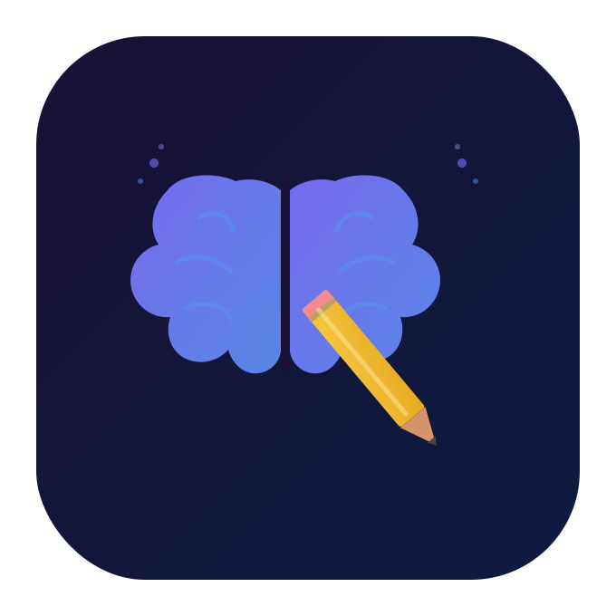
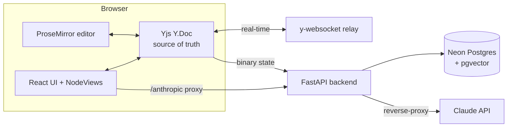

<div align="center">
  
  <h1>Second Brain</h1>
  <p><strong>A local-first, multiplayer research notebook with a CRDT editor and AI cells.</strong></p>
  <p>ProseMirror · Yjs · React 19 · FastAPI · Claude</p>
</div>

---

A cell-based notebook — think Notion meets Jupyter — built on a **hand-rolled ProseMirror
editor** and **Yjs CRDTs** for real-time, offline-first collaboration. Cells can be rich
markdown, an **AI conversation** (Claude, streaming, with RAG over your notes), or a weekly
planner. Everything syncs across tabs and devices and keeps working offline.

> Built as a deep portfolio project around a rare combination: **editor engineering +
> CRDT collaboration + AI integration**. See [`documents/`](documents/) for the architecture.

<!-- TODO: add a screenshot or short demo gif here -->

**1. Main page with multiple cursor:**


**2. AI Report based on Weekly planner:**


**3. AI cell formatting:**


## Why it's interesting

- **Raw ProseMirror, no Tiptap** — full control over the schema (`doc → cell → block`), custom
  NodeViews that embed React, slash menu, and a floating formatting toolbar.
- **Real CRDT collaboration** — Yjs is the source of truth; multiplayer cursors, offline edits,
  and conflict-free merge. Backed by [convergence tests](src/collab/__tests__).
- **Time-travel** — `Y.snapshot` history with restore, including the AI/planner side-data.
- **AI that knows your notebook** — streaming Claude replies with 3-tier context retrieval
  (local cells → doc → cross-doc RAG via pgvector), extended thinking, web search, vision
  (paste images), and a local **Ollama** option for privacy.
- **Durable & private** — Neon Postgres is the real source of truth; the Anthropic key never
  ships in the browser (a backend reverse-proxy injects it).

## Tech stack

| Layer | Stack |
|-------|-------|
| Editor | ProseMirror (raw), React 19, TypeScript, Zustand |
| Collaboration | Yjs, y-prosemirror, y-indexeddb, y-websocket |
| AI | Anthropic Claude SDK (streaming), Ollama (local), pgvector RAG |
| Backend | FastAPI, SQLAlchemy (async), Neon Postgres + pgvector, sentence-transformers |
| Build / i18n | Vite, Vitest, react-i18next (EN/VI) |
| Hosting | Vercel (frontend) · Fly.io (backend + sync relay) |

## Architecture at a glance



Full write-up: [`documents/architecture.md`](documents/architecture.md).

## Quick start

**Prerequisites:** Node 20+ with `pnpm`, Python 3.11+, a [Neon](https://neon.tech) Postgres
database (with the `vector` extension), and optionally [Ollama](https://ollama.com) for local AI.

```bash
# 1. Frontend
pnpm install
cp .env.example .env.local        # adjust URLs if needed
pnpm dev                          # → http://localhost:5173

# 2. Sync server (real-time collab) — separate terminal
pnpm dev:ws                       # → ws://localhost:1234

# 3. Backend (RAG, persistence, Claude proxy) — separate terminal
cd backend
python -m venv .venv && .venv/Scripts/activate   # (Unix: source .venv/bin/activate)
pip install -r requirements.txt
cp .env.example .env              # set DATABASE_URL + ANTHROPIC_API_KEY
uvicorn app.main:app --reload     # → http://localhost:8000
```

The app runs **frontend-only** too — collaboration falls back to local IndexedDB, and AI/RAG
features are simply disabled until the backend is up.

### Environment variables

| Scope | Variable | Purpose |
|-------|----------|---------|
| Frontend | `VITE_BACKEND_URL` | FastAPI base URL (default `http://localhost:8000`) |
| Frontend | `VITE_WS_URL` | y-websocket relay (default `ws://localhost:1234`) |
| Frontend | `VITE_OLLAMA_URL` | local Ollama daemon (default `http://localhost:11434`) |
| Backend | `DATABASE_URL` | Neon Postgres connection string |
| Backend | `ANTHROPIC_API_KEY` | Claude key (server-side only) |
| Backend | `ALLOWED_ORIGINS` | comma-separated CORS origins |

## Scripts

```bash
pnpm dev          # Vite dev server
pnpm dev:ws       # y-websocket sync relay
pnpm dev:backend  # FastAPI (Windows venv path)
pnpm test         # Vitest (CRDT convergence tests)
pnpm build        # tsc -b && vite build
pnpm lint         # ESLint
pnpm format       # Prettier
```

## Project structure

```
src/
  schema.ts        ProseMirror schema (doc → cell → block) + marks
  commands.ts      editor commands (insert / transform / select)
  collab/          Yjs setup, AI threads, snapshots, weekly plans, streaming
  plugins/         slash menu, placeholder, selection, image paste, …
  nodeViews/       React-backed cells (AI, markdown, weekly)
  components/      sidebar, toolbars, modals, language switcher
  hooks/           useNotebookEditor, useDocRegistry
  lib/             config, http, backend sync, image resize, markdown io
  i18n/            react-i18next (en / vi)
  styles/          design-system tokens + per-component CSS
backend/           FastAPI + Neon + pgvector
deploy/            Fly.io configs (backend + sync relay)
documents/         architecture & subsystem docs  ← start here
```

## Documentation

| Doc | What it covers |
|-----|----------------|
| [Architecture](documents/architecture.md) | System overview, data flow, key decisions |
| [Editor (ProseMirror)](documents/editor-prosemirror.md) | Schema, NodeViews, commands, plugins |
| [Collaboration (Yjs)](documents/collaboration-yjs.md) | CRDT model, sync, offline, snapshots |
| [AI](documents/ai.md) | Streaming, RAG, vision, providers |
| [Backend](documents/backend.md) | FastAPI, persistence, RAG, reverse-proxy, images |
| [Deployment](documents/deployment.md) | Vercel + Fly.io |

## Testing

```bash
pnpm test
```

CRDT correctness is covered by [convergence tests](src/collab/__tests__/convergence.test.ts):
two/three simulated peers edit concurrently and the docs must converge byte-identically.

## Status

Actively developed. Core editor, real-time collaboration, AI cells, RAG, and deployment are in
place; see the docs for what's solid and what's still evolving.
